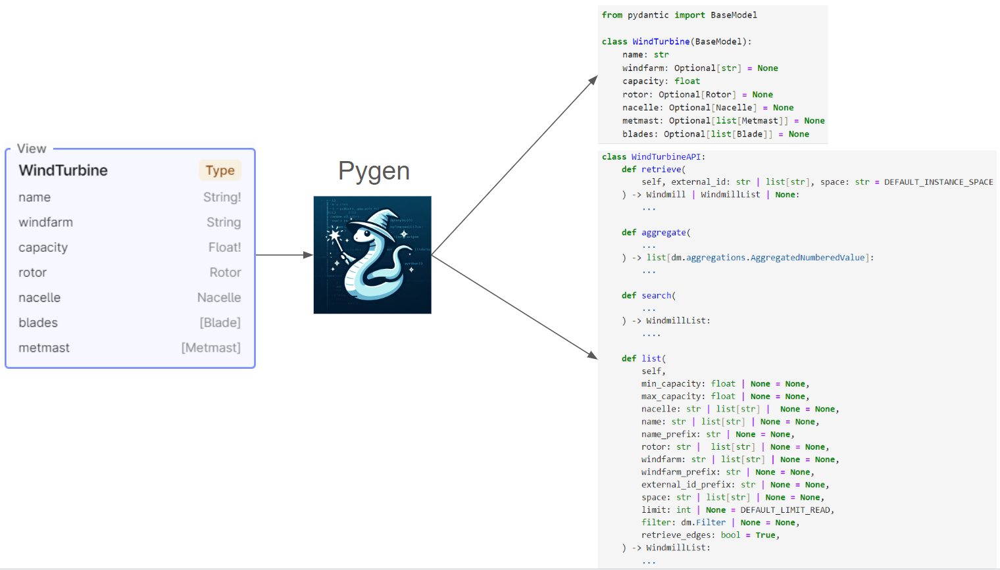
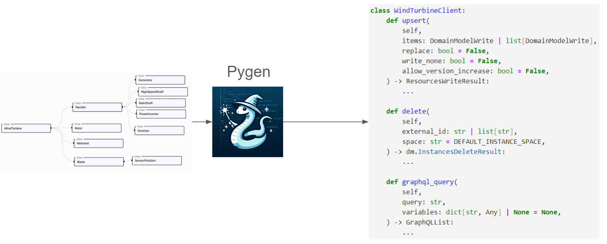

## What is `Pygen`?

You have created your data model and have it ready in Cognite Data Fusion (CDF). Now you want to start writing Python
code to interact with it. Then, you have multiple options

1. You can use `GraphQL`, and call the endpoint `https://{cluster}.cognitedata.com/api/v1/projects/{project}/userapis/spaces/{space}/datamodels/{externalId}/versions/{version}/graphql`.
   This gives you a flexible way to query your data model, but
    - writing the queries can be cumbersome.
    - the response is a dictionary that you need to parse.
    - you need to know the data model structure.
2. You can use the Data Modeling Storage, `DMS` endpoint `https://{cluster}.cognitedata.com/api/v1/projects/{project}/models/instances/`.
   This lacks the context of your data model
    - you are using a set of generic endpoints designed to work with any data model.
    - the response is a dictionary that you need to parse.
    - you need to know the data model structure.

`Pygen` is offering a third option. It generates Python code that wraps the `DMS` endpoint with your
data model. This way, you can interact with your data model using Python objects, which gives you the following benefits:

1. You can interact with your data model using Python objects.
2. Your IDE can provide you with code completion and type hints for your data model.
3. Client-side validation of data when creating or updating objects.
4. Enable you to work in the language of your data model.

## What does `Pygen` actually do?

The input to `Pygen` are the views of the data model (views are represented as types in GraphQL), the output for each
view is data classes and an API class tailored to the view. This is illustrated in the following diagram
(Note the code shown below is a simplified version of the actual code generated by `Pygen`):



In addition, `Pygen` generates a few shared methods that can be used by all the data classes generated
for the views. These are illustrated in the following diagram:




## Data Class(es)

`Pygen` generates three data classes for each view. For example, the view `WindTurbine` will
generate the following data classes:

1. `WindTurbine` - This is used when retrieving wind turbines from CDF. It has properties that
    correspond to the fields in the view that matches whether the field is required or not. In
    addition, it has `data_record` that contains server-set properties
    such as `createdTime`, `lastUpdatedTime`, and `version`.
2. `WindTurbineWrite` - This is used when writing wind turbines to CDF. It has properties that
    correspond to the fields in the view that matches whether the field is required or not. It
    also has a `data_record` field with one property `existing_version` that is used to decide
    how to handle conflicts when updating the wind turbine.
3. `WindTurbineGraphQL` - This is used when parsing a GraphQL response. It has properties that
    correspond to the fields in the view, but all fields are optional. This is because
    `GraphQL` responses can be partial.

In addition, to these three data classes for each view, `Pygen` generates a `WindTurbineList` and
`WindTurbineWriteList` that are UserList of the corresponding data classes. These behaves liken a
regular Python list with a few extra helper methods such as:

 * `.to_pandas()` - Converts the list of WindTurbine to a pandas DataFrame with each column corresponding
    to a property in the WindTurbine data class.
 * `.dump()` - Converts the list of WindTurbine to a list of dictionaries.
 * `.as_external_ids()` - Returns the external ids of the WindTurbine objects in the list.
 * `.as_node_ids()` - Returns the node ids of the WindTurbine objects in the list. A node ID is consist
   of the space + external ID of a WindTurbine object and is used to uniquely identify a WindTurbine object.
 * It also have built in methods for nice display of the list in a Jupyter notebook.

You can convert between the different data classes using the following methods:

 * `wind_turbine_read.as_write()` - Converts a `WindTurbine` object to a `WindTurbineWrite` object.
 * `wind_turbine_graphql.as_write()` - Converts a `WindTurbineGraphQL` object to a `WindTurbineWrite` object.
 * `wind_turbine_graphql.as_read()` - Converts a `WindTurbineGraphQL` object to a `WindTurbine` object.

**Note** When converting from a `WindTurbineGraphQL` to `WindTurbine` or `WindTurbineWrite` all required fields
must be present in the `WindTurbineGraphQL` object, otherwise an exception will be raised.


## API Class

`Pygen` generates an API class for each view. The API class contains methods for retrieving objects from CDF.
For example, the `WindTurbine` API class will have the following methods:

 * `.retrieve(...)` - Retrieves one or more wind turbines from CDF. The method takes a list of external ids
    and returns a `WindTurbineList` object.
 * `.list(...)` - This method returns all wind turbines from CDF matching the filter criteria passed in
   through the method arguments.
 * `.search(...)` - This method searches for wind turbines in CDF matching the search criteria passed in
   through the method arguments.
 * `.aggregate(...)` - This method aggregates wind turbines in CDF matching the aggregation criteria passed in
   through the method arguments.
 * `.histogram(...)` - This is a special aggregation method that returns a histogram of the wind turbines in CDF
   matching the aggregation criteria passed in through the method arguments.
 * `(...)` - Doing a call directly on the API class will enable you to write a Python query for retrieving wind turbines
   with nested objects from CDF.

For each of these methods, `pygen` generates filter parameters that correspond to the field types in the view. For example,
a field of type `string` will have `Equals`, `In`, and `Prefix` filter parameters in `list()`, `search()`,
`aggregate()`, `.histogram()` and `(...)` methods. For `WindTurbine` with a field `name` of type `string`, the first
parameters of the `list()` methods will be:

```python
def list(self, name: str | list[str] | None = None, name_prefix: str | None = None, ...):
    ...
```

The generated API class will also have properties linking to the other API classes for each edge and timeseries
field in the view. For example, the `WindTurbine` has edges to `Blade`and `Metmast`, so the `WindTurbine` API
class will have the following properties:

* `.blade` - This is a property that returns the `Blade` API class.
* `.metmast` - This is a property that returns the `Metmast` API class.

If the `WindTurbine` had a field `activePower` of type timeseries, then the `WindTurbine` API class will have the following
property:

* `.active_power` - This is a property that returns an API class for the `activePower` timeseries. This
   class will have methods for retrieving the timeseries data from CDF, as well as methods for retrieving the
   datapoints for the timeseries.


## API Client

`Pygen` generates a shared API client that contains all the API classes for each view. In addition, it has
three methods which are shared.

* `.upsert(...)` This method can take any of the write data classes generated for the views as input,
  or a list of write data classes. This has multiple benefits over using the `DMS` endpoint directly:

     - It supports nested objects. These will be unpacked into nodes and edges before being sent to CDF.
     - It automatically creates edges based on the relationships between the objects.
     - It will automatically create `TimeSeries` objects for timeseries fields.

* `.delete(...)` This method can is a thin wrapper around the `DMS` endpoint for deleting objects.

* `.graphql_query(...)` This method takes a `GraphQL` query as input and returns the response from CDF.
  In difference from using the regular `GraphQL` endpoint, this method will automatically parse the response
  to the corresponding data classes for the views in the query.
